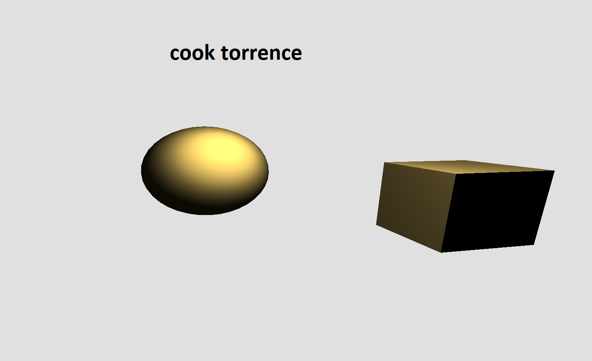
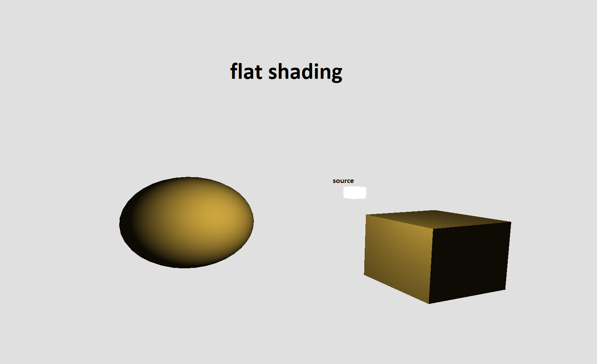
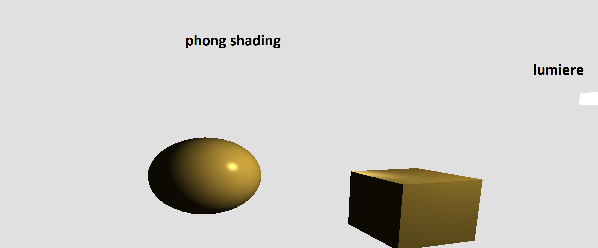
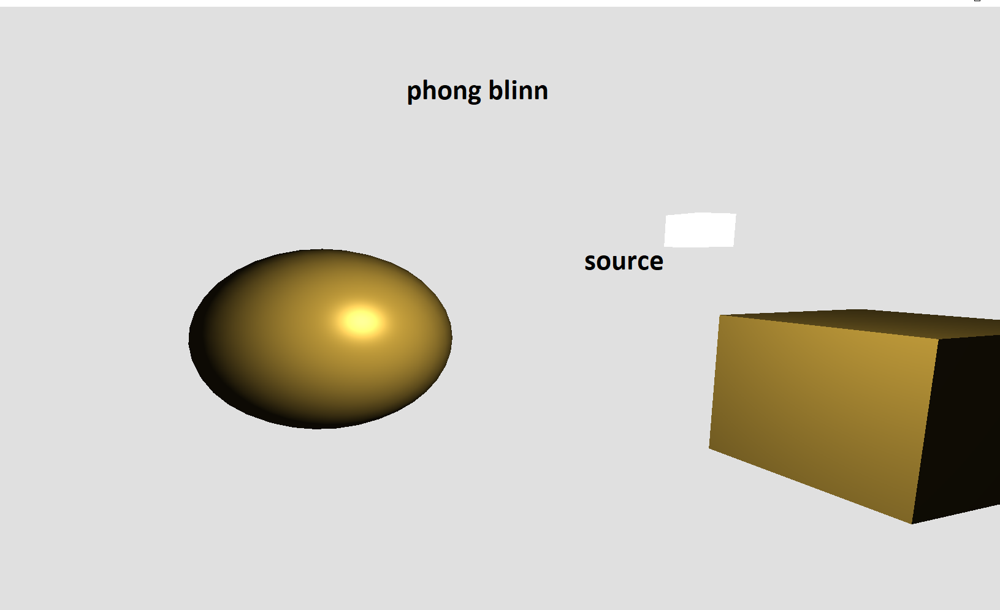
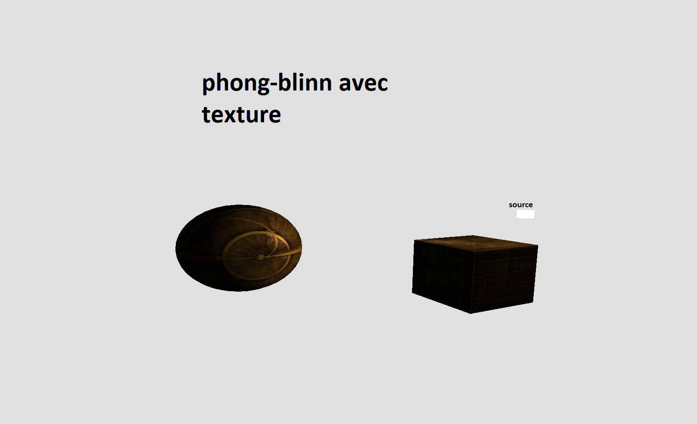
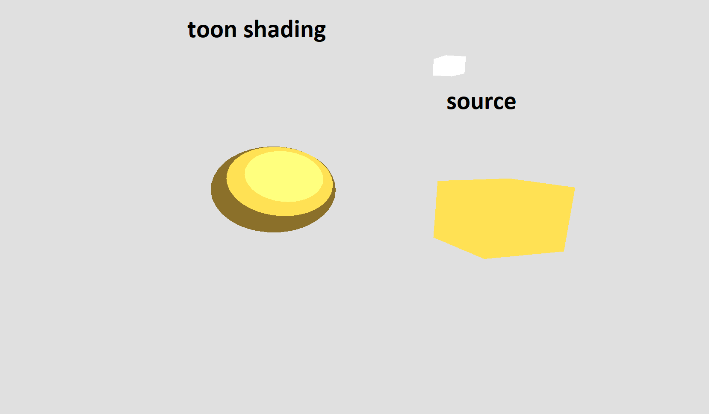

# LearnOpenGL
 OpenGL basics, shaders based on physical models

# Project Description
In this Project We worked with the modern OpenGL, where we it implements Various OpenGL aspects

### Project Subjects

*  Mesh Rendering with GPU (sphere and Cube)
* Vertex Array Object
* Vertex Buffer Object
* Transformation Matrices (Camera, Projection, Rotation, Translation and Scale)
* Surfaces' normals, colours, and Texture Handling
* Scene Navigation with Mouse & Keyboard

* implementing Shader models with GLSL for diffrent Materials (Gold, Silver, Bronze, …)
  * Vertex Shader & Fragement Shader
* G-buffers

#### Implemented Shader Models
  * Phong Model
  * Blinn Phong Model
  * Cook Torrence Model
  * Lambert Model
  * Toon Model

### Shaders Results (For Gold Material)
**Note** you can find the other material once you execute the Code

#### Cook Torrance Model

#### Flat Shading Model

#### Phong Shading Model

#### Blinn Phong Shading Model

#### Blinn Phong Shading Model with Texture

#### Toon Shading Model

